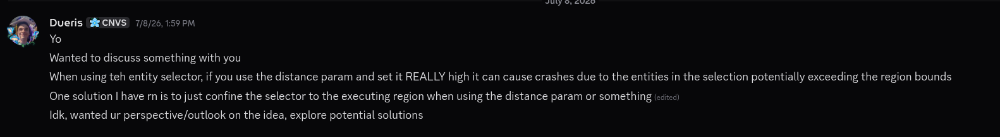
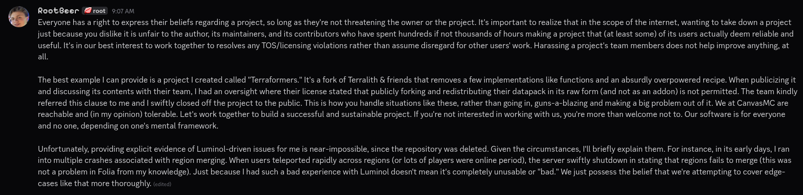
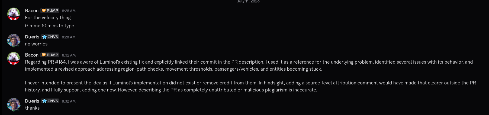
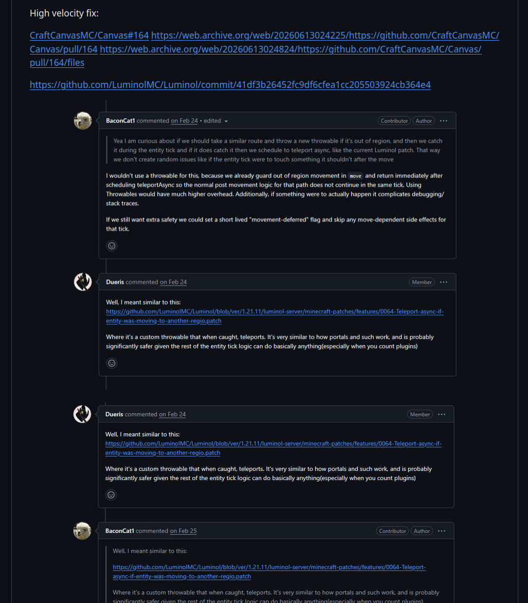
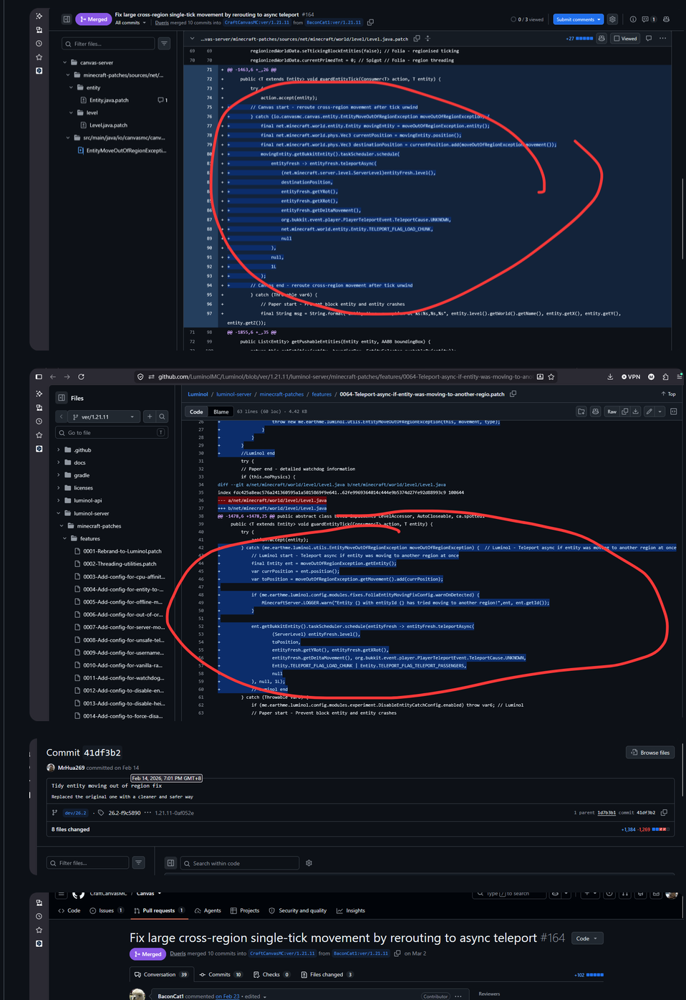
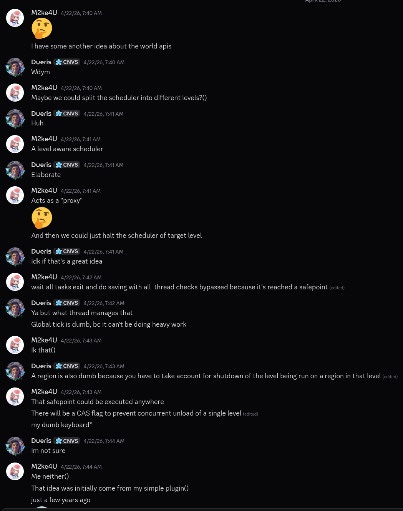
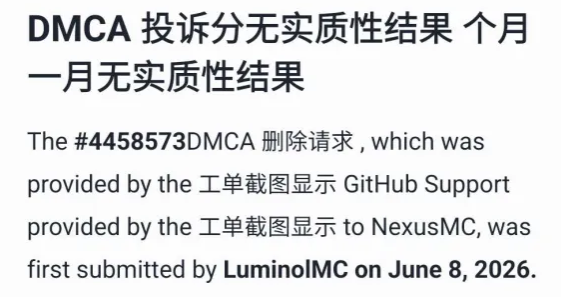
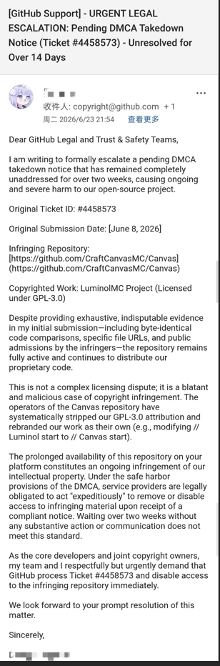
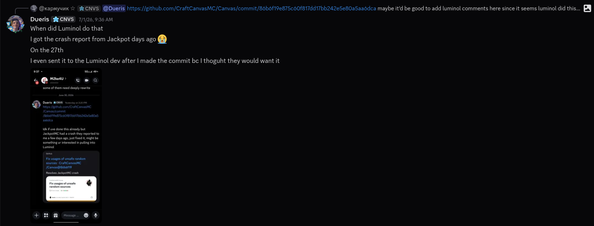
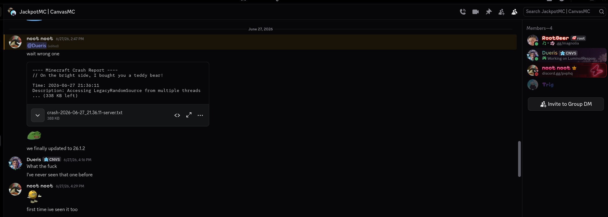

# luminol response

This page is made to document and bring CanvasMCs side of the recent controversy regarding LuminolMC and CanvasMC,
specifically going over claims that were made by Luminol about Canvas and our thoughts regarding it. If you have
questions post reading the totality of this document, feel free to reach out in discord here:

https://canvasmc.io/discord
https://discord.com/channels/1168986665038127205/1525543319424335943

This response goes in depth into multiple claims Luminol made, our thoughts, and overall our response to the actions
of the developers of Luminol. To see Luminols side, see here:

https://github.com/LuminolMC/AboutCanvas

Fair warning, this is a bit all over the place, so apologies in advance.

# AboutCanvas response

To start off, the images provided in this screenshot are of ages ago, of which have been resolved because we removed the
related statement from our documentation. I cant really show proof that we discussed this since the discord got deleted
though. It was originally discussed when a "Canvas shame fork" or whatever was created by the Luminol author,
[Shiroha](https://github.com/StarCodeClub/Shiroha)

You can also see in one of the comments I made(the bottom image), I meant nothing against Luminol in my comment, my
comment was entirely saying I preferred Canvas over Luminol because Canvas has more fixes to offer than Luminol. That's
not trying to take a shot at them at all, I even said below that it was nothing against Luminol. I said I even liked
some of their stuff too, which is slightly covered by the red line so Ill include a new image below just to show Im not
lying or anything

It wasn't meant as an attack on them, I genuinely didnt see Canvas and Luminol competing, just thought we would coexist.
I even reached out to the dev on a few occasions to discuss potentail fixes to issues I found. I wanted more collaboration,
not a mess of drama and competition. The image below to sorta prove that I wanted some form of collaboration:

As for the 2nd image in the "AboutCanvas" fork, I will say that those crashes I mentioned I was told from a trusted
source, this is their response to when I asked to comment about the 2nd screenshot provided by the Luminol "AboutCanvas"
repository.

Not meant to be malicious, but transparent of my knowledge. This was later discussed in their Discord server during the
Shiroha drama.

Most of this stuff was resolved after being brought up by the Luminol devs when the Shiroha drama went down and I *think*
(I dont remember fully) I said to just contact us if further issues happen down the line rather than just make another
fork made to just shit on eachother. I would have rathered that happen aswell, rather than making both communities blow
up at eachother.

# high velocity fix

As for this, I was personally unaware if it was copied directly or not. I recalled them having a patch that was similar
to this, so I mentioned maybe doing something similar. Not saying to copy, not saying to do anything, just maybe we do
this similar to what they did if it works well or something. Not meant as malicious competition or stealing or anything,
just said "maybe something like this would be neat." I also think this isn't the greatest piece of evidence to support
their claims, given this is from a contributor not a part of the Canvas team at the time of writing.

# world load and unload api

As for this, Canvas has had the world load/unload API MUCH longer than Luminol has. In actuality, during the development
of Luminols world load/unload API, me(Dueris) and the developer of Luminol were actively discussing their implementation
and sharing ideas.

While the screenshot provided doesnt really prove much, it shows we were at least discussing ideas and stuff and that
nothing was meant as a way to copy them. If you look at our implementations you can even see they follow a similar
process in the end, but they aren't at all copied from eachother.

# async protocol switch

When reviewing this, it does follow a similar code flow but parts aren't 1:1, Ill be fixing this once I am home. This is
sort of the reason why I ask we just discuss this privately, since it could just be an honest mistake(like this one).
And as such, it's something that can be done without drama and can just be fixed quickly when people have time, not
blowing all of this up.

# kenny list of shame

As for https://github.com/kennytv/list-of-shame/issues/108, this was already known by me but is VERY outdated now, why
this was brought up, no clue. But this is irrelevant as of later versions of Canvas.

# Our response to the whole thing

The rest of this is just a yap session from Dueris. TLDR, Im angry, this is frustrating, the rest of this just goes in
depth as to why and what and stuff.

To start off, Im incredibly angry. To give backstory, the [Shiroha](https://github.com/StarCodeClub/Shiroha) repository
is a repository made by the maintainer of Luminol, MrHua269. This was initially created as a fork to protest Canvas of
sorts for previous mistakes it made. When I discovered this, I reached out and wanted to discuss it because frankly,
that sort of stuff is just inappropriate. If you have an issue with someone, say it to their face and resolve the
situation maturely. After our discussion, the part regarding Canvas was removed in this commit:

https://github.com/StarCodeClub/Shiroha/commit/3681281089b90e8cf5cd4fe2cff1df11a1cf42e3

After this, all issues, at least to my knowledge were resolved, and any further issues would be discussed privately with
eachother to prevent us pointing fingers and turning people against eachother. *Clearly* that was not what happened.

The DMCA takedown I think pissed me off and upset me the most.

According to the SS, this was made **June 8th.** This is completely insane, especially when this can be resolved with
just sending me a fucking DM asking me to fix a few comments. But OK!

Canvas has made continuous attempts at being transparent about our patches and our sources. You can even see in our
`src/main/resources` directory of `canvas-server` at the time of writing that we include various licenses inside there
to try and be more transparent about our sources. While this maybe isnt quite what's needed, Im mentioning it as proof
that we are genuinely trying to make an effort to be good and transparent regarding this. We have constantly showed we
are wanting to value the work of our contributors and sources of patches and *very* willing to credit it if we make a
mistake along the way.

As for the "MALICIOUS copyright infringements" mentioned here:

I actually have the crash report, provided by JackpotMC who runs Canvas, which happened June 27th and provided the same
day. This is of our dev GC that also showcases that I indeed, did not know about Luminols changes at the time of writing
my fix. Infact, *both* Luminols and Canvas' patch launched on the same day, June 30th. The crash report, has parts
omitted as to protect the privacy of JackpotMC.

The fact it's being labeled as "malicious" is outright insanity. We have no malicious intent, no desire to start drama,
no desire to create competition, no desire to steal at all, nothing. I do this for my love of programming and Minecraft.
This is a stupid amount of drama for something that can be solved by asking politely to please fix a fuckign mistake I
made ages ago for like tiny patches that are insignificant in the full context of Canvas' full patch set. I am human, I
will make mistakes and HAVE made mistakes. Some improper annotations are simply because sometimes when authoring or
updating I apply the patch by hand, and out of habit do `// Canvas` comments or something. I literally did that in a
Paper PR once(no clue if it's still able to be found but whatever) by accident.

In their DMCA takedown notice they claimed Canvas' copyright infringements were "explicit and severe", of which this
is really not the case. "Severe" is a strong word to use when the related patches are miniscule in comparison to the
full patch set Canvas provides, outside of the core region threading patch from Folia. "Explicit" also implies this was
intentional, which it wasn't. And again, this could all be solved by DMing us like we asked them to after they made a
fucking "protest fork". When we discussed with them the issues they brought up were fixed within HOURS of that discussion,
some made in the moment of that discussion. I cant provide screenshots though, because the discord is gone. We are not
trying to remove people from credit of their work or time, we have put CONSTANT efforts to showcase the work of our
community and even include the contributors of our project alongside the authors of CanvasMC in our version command to
try and showcase recognition for those people. This is simply at most a mistake and not deserving of any of this sort
of insanity that was unleashed.

They also claim that our README deliberately omits Luminol as a source, and that our license "claims ownership over
Luminol-derived patches", which is not true. The README is something on our internal TODO to update because at the time
of writing it's kinda bleh, but it wasn't intentionally omitted, just an accident where we forgot to add them...

Requesting the "immediate removal" of our repository for a dispute that could be settled DMs in 5 minutes is insane.

To address a few comments in one of our issue reports discussing this:
- Luminol did not reach out to Canvas at all actually, WE reached out to them. As evident by Shiroha. They reached out
one maybbe 2 times(to the best of my knowledge at the time of writing this) in a PR regarding async protocol switch which
was fixed later on and about a patch commit I did a few months back but I fixed that one a few hours later
- I did acknowledge my mistakes and then fixed them ASAP. As evident by Shiroha
- We do contain license notices for projects, which doesnt mean anything really, but it is more to show that we are trying
to show that we are trying to make an effort at showcasing our origins for patches and our contributors. I simply forgot
to include Luminol in there, which I dont think is a very hard thing to believe to be honest. Mistakes happen and I am
a VERY forgetful person, so sometimes I forget to do it. But again, bring it up in DMs, and I fix it within a few hours

# Closing

At the time of writing Canvas' future I will say is completely unknown. The amount of drama surrounding Canvas is too
much for me and to be blunt, may result in my leave of the community and the immediate removal of Canvas from github.
There is no guarantee for it happening or not, however this whole ordeal is completely unacceptable and out of line and
I will prioritize myself over Canvas, and if that means it's better for my mental health to delete Canvas, I will.

This is a deeply frustrating situation and one I will be investigating more over the next few hours at the time of
writing this. There was no malicious intent by Canvas, only honest mistakes made by imperfect people who are just trying
to do better. We already are working on fixing any valid claims against Canvas in our patch sources, as we seriously did
not steal anything from anyone, and did not mean any malicious intent by anything. It's small things that were blown so
heavily out of porportion that it resulted in 2 communities at eachothers throats for something that could be settled
privately within an hour.

You cant copyright an idea, both Luminol and Canvas have similar projects with the same end goal of stabilizing Folia
to the best of our abilities. We have similar code, yes, like the JackpotMC crash for example. Does that mean we are
maliciously trying to compete with them or are plagerizing things and intentionally cause harm? Absolutely not. We are
bound to have similar code, we are similar projects. We have always been very vocal about trying to be on good relations
with Luminol and trying to do our best and do better about patch origins and proper crediting of contributors and other
patch sources. No prior attempts were made to contact the Canvas team or myself. Instead, every time Luminol was upset
regarding something Canvas did, they did not make any attempts to contact us and instead went to extremes. This whole
situation is frankly, childish. This should have been handled maturely like adults privately in DMs, not throwing 2
communities against eachother and then ghosting the internet.

Proof we are already doing things to fix:

- https://github.com/CraftCanvasMC/Canvas/pull/288
- https://github.com/CraftCanvasMC/Canvas/commit/3b5289569fb6ad84752acc7622f655cb538be5d0
- https://github.com/CraftCanvasMC/Canvas/commit/387cfe726e7e8932f517d17e35b6299b6269cecf

I think it's worth noting this was merged within like 20 minutes of this repo being public... I think that sorta shows
that we are very willing to fix these issues. A more in-depth review will be conducted later, but at the time of writing
I need to go drive home.

On behalf of the CanvasMC team, we are genuinely sad to see Luminol leave. We meant no competition with them, I dont
want competition with anyone. We all have the same goal, to optimize and stabilize Minecraft/Folia through the work of
our communities and incredibly talented minds. I do wish all of this was prevented and discussed privately, but there
isnt much we can do about that now. We at CanvasMC, if I decide to let Canvas live, will enforce stricter rules and
expectations on our team and contributors for licensing and patch origins to prevent issues like this in the future. This
all is just a few honest mistakes made by imperfect people. We genuinely want to and care about showcasing our sources
and our contributors and such, as we believe that it is the combined effort of the totality of a communnity that makes
something great, not the standalone work of a few individuals.

If you have questions or want more things addressed, contact us in our discord in the respective thread for it:
https://canvasmc.io/discord
https://discord.com/channels/1168986665038127205/1525543319424335943

# closing thoughts

My(Dueris) stance on all of this is mostly that I am disappointed. What could have been resolved in DMs in a few hours
turned into a mess of drama throwing 2 communities at each others throats. While yes, I have made mistakes and I am
imperfect. I will admit, I have made mistakes, and I will continue to make mistakes probably as that is human nature.
That does not mean though that I am unwilling to fix these mistakes. Already, within hours of the initial post from
Luminol being up, we have fixed the main issues that were addressed, only being delayed by the drama that was created
from the post.

I will be taking a break from the internet as to try and calm down and decide what to do next and how I want to go about
it all. I am hoping that this will die down eventually. If you have questions, feel free to ask them, I am happy to
answer any questions people may have or clarify information. There was no malintent by anything, and it is my hope that
this document helps clarify information and bring truths to light. We still seek good terms with Luminol, and we will
always continue trying to do better and do the best we can to properly attribute our patches, credit patch sources and
authors, etc. We at Canvas have no intent or desire to cause harm to anyone, or cause further drama, or to discredit
people or plagerize anyone, etc. We wish the developers of Luminol the best, and hope someday this dispute is calmed
down, and we all move on, and it becomes a thing of the past. We will only continue to try and do our best.

Thank you for reading

\- Dueris, owner of CanvasMC
